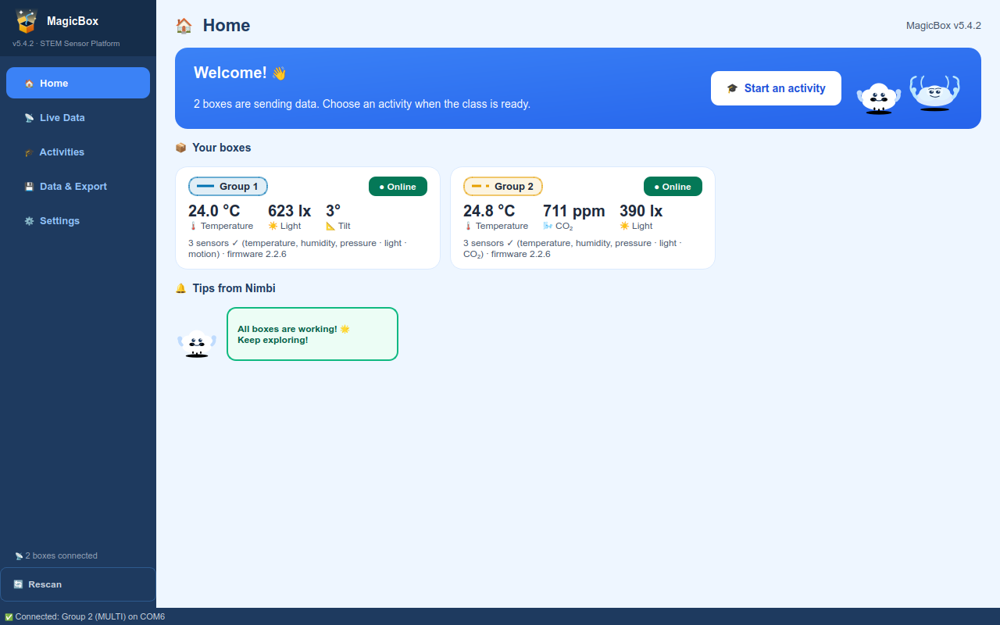
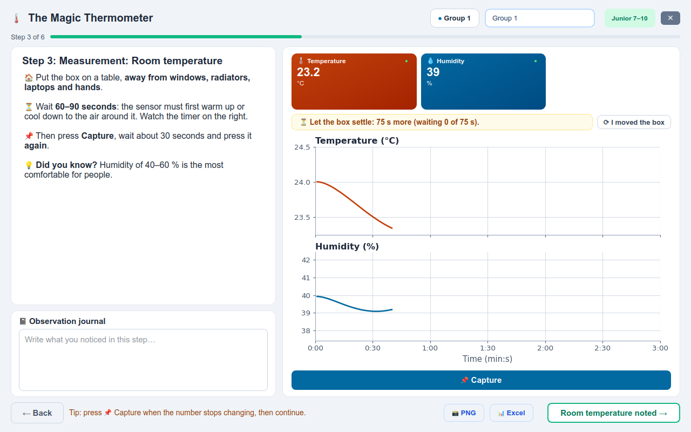
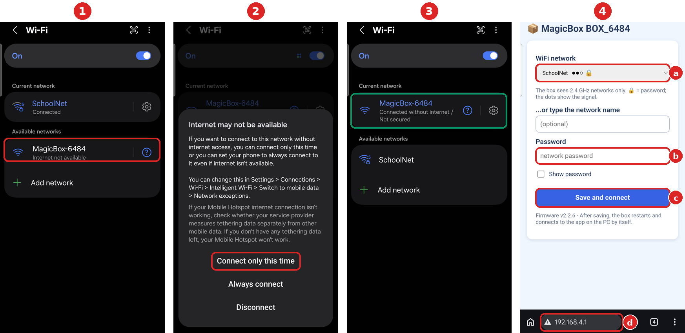

# MagicBox

**English** · [Română](README_RO.md)

**Version 5.4.2** · Windows 10 / 11 · the app and the documents in Romanian and English

## For teachers

MagicBox is a sensor box for science lessons. Pupils use it to measure
temperature, humidity, air pressure, light, carbon dioxide and motion. The
application on the computer charts the measurements live and leads the class
through guided experiments, explore tools and games, for pupils aged 7 to 19.

**Every activity has a teacher guide and a pupil sheet, in Romanian and in
English.** The guide covers preparing the lesson, running it, the questions to
ask and where pupils usually go wrong. In the app, the **Open guide** button
on each activity opens the right one.

*Left: the Home page, with the connected boxes. Right: a guided experiment.
Every screen and every button is explained, with pictures, in the
[User manual](MagicBox/docs/en/user_manual.pdf) [⬇](https://github.com/GeoEduLab/MagicBox/raw/main/MagicBox/docs/en/user_manual.pdf).*

### ⬇️ [Download MagicBox 5.4.2 (a single ZIP file)](https://github.com/GeoEduLab/MagicBox/releases/download/v5.4.2/MagicBox_v5.4.2.zip)

The archive holds everything: the app, the guides, the sheets, the box
firmware and its flashing guide, all from the same version.

The documents alone (guides, sheets, First steps, the technical manual, the
flashing guide, in English and Romanian, in the same folders as in the app):
**[MagicBox_docs_v5.4.2.zip](https://github.com/GeoEduLab/MagicBox/releases/download/v5.4.2/MagicBox_docs_v5.4.2.zip)**. Every PDF below also opens here
on GitHub; the ⬇ arrow next to it downloads it.

---

## 1. Installing the app

1. Unzip it (right-click → **Extract All…**) into **Documents** or onto a
   USB stick. Not into *Program Files*, and do not run the app from inside the
   ZIP. Keep the whole `MagicBox` folder together.
2. Run **`MagicBox.exe`**. Nothing else needs installing.
3. If *"Windows protected your PC"* appears, click **More info → Run anyway**.
   The app has no commercial signature; that is all the message means.
4. When Windows asks about the network, tick **Private networks** and click
   **Allow access**. Without it the boxes cannot connect over WiFi.

The app starts in Romanian; switch to English in **Setări → Limba și
afișarea → Limba:** (Settings → Language), then restart it. The steps from the
download to the first box on screen, with a "what you see → what to do" table,
are in [First steps](MagicBox/docs/en/first_steps.pdf) [⬇](https://github.com/GeoEduLab/MagicBox/raw/main/MagicBox/docs/en/first_steps.pdf) (two pages).

**Over USB:** use a *data* cable. If the box does not appear within
10 seconds, install the board driver once:
[CP210x](https://www.silabs.com/developers/usb-to-uart-bridge-vcp-drivers)
or [CH340](https://www.wch-ic.com/downloads/CH341SER_EXE.html).

**Over WiFi:** once per box, from a phone.

1. Switch the box on. The first time, it opens a network called
   **MagicBox-XXXX** (XXXX = the last four characters of the box ID;
   **CutiaMagica-XXXX** on firmware older than 2.2.6). Tap it in the phone's
   WiFi settings.
2. The phone says the network has no internet (on Samsung: *Internet may not
   be available*): choose **Connect only this time**.
3. The phone stays on **MagicBox-XXXX**, "without internet": that is normal.
4. The setup page opens by itself; if it does not, open
   **http://192.168.4.1** in the browser (d). Pick the class network from the
   list (a), type its password (b) and tap **Save and connect** (c). The box
   restarts and joins the network; the app finds it on its own.

The box sees **2.4 GHz networks only**: on a dual-band router keep the 2.4 GHz
band switched on. The computer and the boxes must be on the same network. If
the school network does not work (a sign-in with a user name *and* a password,
or devices that cannot see each other), use a phone hotspot. To change
network: hold the box's BOOT button while switching it on, and it forgets the
saved one.

**Sensors:** the box has three sockets for four sensors, so one is always
left out, and it shows as `FAIL` at power-on: that is normal. With the box
switched off, plug in the sensor the activity needs (the games need the
motion sensor).

## 2. The box firmware

Boxes that work need no reflashing. Load the firmware onto a new box, or when
the app warns that a box runs old firmware. The steps, with pictures, are in
the [flashing guide](MagicBox/firmware/FLASHING_GUIDE.pdf) [⬇](https://github.com/GeoEduLab/MagicBox/raw/main/MagicBox/firmware/FLASHING_GUIDE.pdf): about 30 minutes the
first time, then 2–3 minutes per box. Use the `serial_wifi_…` variant (USB and
WiFi) from the [firmware](MagicBox/firmware) folder.

If a box lying flat shows acceleration Z of about −1 g instead of +1 g, tick
**Motion sensor upside down** for that box in **Settings → Box names**. No
other firmware is needed.

## 3. The documents

All of them in one archive: **[MagicBox_docs_v5.4.2.zip](https://github.com/GeoEduLab/MagicBox/releases/download/v5.4.2/MagicBox_docs_v5.4.2.zip)**. A
single PDF: click its name to read it on GitHub, or ⬇ to download it.

| | English | Română |
|---|---|---|
| First steps: installing, connecting, common problems | [first_steps.pdf](MagicBox/docs/en/first_steps.pdf) [⬇](https://github.com/GeoEduLab/MagicBox/raw/main/MagicBox/docs/en/first_steps.pdf) | [primii_pasi.pdf](MagicBox/docs/ro/primii_pasi.pdf) [⬇](https://github.com/GeoEduLab/MagicBox/raw/main/MagicBox/docs/ro/primii_pasi.pdf) |
| User manual: every screen and every button, with pictures | [user_manual.pdf](MagicBox/docs/en/user_manual.pdf) [⬇](https://github.com/GeoEduLab/MagicBox/raw/main/MagicBox/docs/en/user_manual.pdf) | [manual_de_utilizare.pdf](MagicBox/docs/ro/manual_de_utilizare.pdf) [⬇](https://github.com/GeoEduLab/MagicBox/raw/main/MagicBox/docs/ro/manual_de_utilizare.pdf) |
| Activities by grade and subject (one page) | [activities_by_grade_and_subject.pdf](MagicBox/docs/en/activities_by_grade_and_subject.pdf) [⬇](https://github.com/GeoEduLab/MagicBox/raw/main/MagicBox/docs/en/activities_by_grade_and_subject.pdf) | [activitatile_pe_clase_si_discipline.pdf](MagicBox/docs/ro/activitatile_pe_clase_si_discipline.pdf) [⬇](https://github.com/GeoEduLab/MagicBox/raw/main/MagicBox/docs/ro/activitatile_pe_clase_si_discipline.pdf) |
| Curriculum plan (which activity for which grade) | [curriculum_plan.pdf](MagicBox/docs/en/curriculum_plan.pdf) [⬇](https://github.com/GeoEduLab/MagicBox/raw/main/MagicBox/docs/en/curriculum_plan.pdf) | [plan_curricular.pdf](MagicBox/docs/ro/plan_curricular.pdf) [⬇](https://github.com/GeoEduLab/MagicBox/raw/main/MagicBox/docs/ro/plan_curricular.pdf) |
| Technical manual and troubleshooting | [technical_manual.pdf](MagicBox/docs/en/technical_manual.pdf) [⬇](https://github.com/GeoEduLab/MagicBox/raw/main/MagicBox/docs/en/technical_manual.pdf) | [manual_tehnic.pdf](MagicBox/docs/ro/manual_tehnic.pdf) [⬇](https://github.com/GeoEduLab/MagicBox/raw/main/MagicBox/docs/ro/manual_tehnic.pdf) |
| Flashing the firmware | [FLASHING_GUIDE.pdf](MagicBox/firmware/FLASHING_GUIDE.pdf) [⬇](https://github.com/GeoEduLab/MagicBox/raw/main/MagicBox/firmware/FLASHING_GUIDE.pdf) | [FLASHING_GUIDE_RO.pdf](MagicBox/firmware/FLASHING_GUIDE_RO.pdf) [⬇](https://github.com/GeoEduLab/MagicBox/raw/main/MagicBox/firmware/FLASHING_GUIDE_RO.pdf) |

What changed between versions: [CHANGELOG.txt](MagicBox/CHANGELOG.txt) (the app)
and [firmware/CHANGELOG.txt](MagicBox/firmware/CHANGELOG.txt).

---

## The activities

Every PDF opens right here on GitHub; ⬇ next to it downloads the file.
Grades follow the Romanian school system (II = age 8, XII = age 18).

### Guided experiments

| Activity | Grades | Teacher guide | Pupil sheet |
|---|---|---|---|
| 🌞 Light is Everywhere | II–IV | [EN](MagicBox/docs/en/teacher_guides/light_is_everywhere.pdf) [⬇](https://github.com/GeoEduLab/MagicBox/raw/main/MagicBox/docs/en/teacher_guides/light_is_everywhere.pdf) · [RO](MagicBox/docs/ro/ghiduri_profesor/lumina_de_pretutindeni.pdf) [⬇](https://github.com/GeoEduLab/MagicBox/raw/main/MagicBox/docs/ro/ghiduri_profesor/lumina_de_pretutindeni.pdf) | [EN](MagicBox/docs/en/student_sheets/light_is_everywhere.pdf) [⬇](https://github.com/GeoEduLab/MagicBox/raw/main/MagicBox/docs/en/student_sheets/light_is_everywhere.pdf) · [RO](MagicBox/docs/ro/fise_elev/lumina_de_pretutindeni.pdf) [⬇](https://github.com/GeoEduLab/MagicBox/raw/main/MagicBox/docs/ro/fise_elev/lumina_de_pretutindeni.pdf) |
| 🌡️ The Magic Thermometer | II–IV | [EN](MagicBox/docs/en/teacher_guides/magic_thermometer.pdf) [⬇](https://github.com/GeoEduLab/MagicBox/raw/main/MagicBox/docs/en/teacher_guides/magic_thermometer.pdf) · [RO](MagicBox/docs/ro/ghiduri_profesor/termometrul_magic.pdf) [⬇](https://github.com/GeoEduLab/MagicBox/raw/main/MagicBox/docs/ro/ghiduri_profesor/termometrul_magic.pdf) | [EN](MagicBox/docs/en/student_sheets/magic_thermometer.pdf) [⬇](https://github.com/GeoEduLab/MagicBox/raw/main/MagicBox/docs/en/student_sheets/magic_thermometer.pdf) · [RO](MagicBox/docs/ro/fise_elev/termometrul_magic.pdf) [⬇](https://github.com/GeoEduLab/MagicBox/raw/main/MagicBox/docs/ro/fise_elev/termometrul_magic.pdf) |
| 🫁 The Air We Breathe | II–IV | [EN](MagicBox/docs/en/teacher_guides/air_we_breathe.pdf) [⬇](https://github.com/GeoEduLab/MagicBox/raw/main/MagicBox/docs/en/teacher_guides/air_we_breathe.pdf) · [RO](MagicBox/docs/ro/ghiduri_profesor/aerul_pe_care_il_respiram.pdf) [⬇](https://github.com/GeoEduLab/MagicBox/raw/main/MagicBox/docs/ro/ghiduri_profesor/aerul_pe_care_il_respiram.pdf) | [EN](MagicBox/docs/en/student_sheets/air_we_breathe.pdf) [⬇](https://github.com/GeoEduLab/MagicBox/raw/main/MagicBox/docs/en/student_sheets/air_we_breathe.pdf) · [RO](MagicBox/docs/ro/fise_elev/aerul_pe_care_il_respiram.pdf) [⬇](https://github.com/GeoEduLab/MagicBox/raw/main/MagicBox/docs/ro/fise_elev/aerul_pe_care_il_respiram.pdf) |
| 🏠 Indoor Pollution | V–VIII | [EN](MagicBox/docs/en/teacher_guides/indoor_pollution.pdf) [⬇](https://github.com/GeoEduLab/MagicBox/raw/main/MagicBox/docs/en/teacher_guides/indoor_pollution.pdf) · [RO](MagicBox/docs/ro/ghiduri_profesor/poluarea_de_interior.pdf) [⬇](https://github.com/GeoEduLab/MagicBox/raw/main/MagicBox/docs/ro/ghiduri_profesor/poluarea_de_interior.pdf) | [EN](MagicBox/docs/en/student_sheets/indoor_pollution.pdf) [⬇](https://github.com/GeoEduLab/MagicBox/raw/main/MagicBox/docs/en/student_sheets/indoor_pollution.pdf) · [RO](MagicBox/docs/ro/fise_elev/poluarea_de_interior.pdf) [⬇](https://github.com/GeoEduLab/MagicBox/raw/main/MagicBox/docs/ro/fise_elev/poluarea_de_interior.pdf) |
| 🌿 CO₂ and Photosynthesis | X–XII | [EN](MagicBox/docs/en/teacher_guides/co2_and_photosynthesis.pdf) [⬇](https://github.com/GeoEduLab/MagicBox/raw/main/MagicBox/docs/en/teacher_guides/co2_and_photosynthesis.pdf) · [RO](MagicBox/docs/ro/ghiduri_profesor/co2_si_fotosinteza.pdf) [⬇](https://github.com/GeoEduLab/MagicBox/raw/main/MagicBox/docs/ro/ghiduri_profesor/co2_si_fotosinteza.pdf) | [EN](MagicBox/docs/en/student_sheets/co2_and_photosynthesis.pdf) [⬇](https://github.com/GeoEduLab/MagicBox/raw/main/MagicBox/docs/en/student_sheets/co2_and_photosynthesis.pdf) · [RO](MagicBox/docs/ro/fise_elev/co2_si_fotosinteza.pdf) [⬇](https://github.com/GeoEduLab/MagicBox/raw/main/MagicBox/docs/ro/fise_elev/co2_si_fotosinteza.pdf) |
| 📊 The Seismometer | V–XII | [EN](MagicBox/docs/en/teacher_guides/seismometer.pdf) [⬇](https://github.com/GeoEduLab/MagicBox/raw/main/MagicBox/docs/en/teacher_guides/seismometer.pdf) · [RO](MagicBox/docs/ro/ghiduri_profesor/seismograful.pdf) [⬇](https://github.com/GeoEduLab/MagicBox/raw/main/MagicBox/docs/ro/ghiduri_profesor/seismograful.pdf) | [EN](MagicBox/docs/en/student_sheets/seismometer.pdf) [⬇](https://github.com/GeoEduLab/MagicBox/raw/main/MagicBox/docs/en/student_sheets/seismometer.pdf) · [RO](MagicBox/docs/ro/fise_elev/seismograful.pdf) [⬇](https://github.com/GeoEduLab/MagicBox/raw/main/MagicBox/docs/ro/fise_elev/seismograful.pdf) |
| ✈️ Flying Straight | II–IV | [EN](MagicBox/docs/en/teacher_guides/flying_straight.pdf) [⬇](https://github.com/GeoEduLab/MagicBox/raw/main/MagicBox/docs/en/teacher_guides/flying_straight.pdf) · [RO](MagicBox/docs/ro/ghiduri_profesor/zbor_drept.pdf) [⬇](https://github.com/GeoEduLab/MagicBox/raw/main/MagicBox/docs/ro/ghiduri_profesor/zbor_drept.pdf) | [EN](MagicBox/docs/en/student_sheets/flying_straight.pdf) [⬇](https://github.com/GeoEduLab/MagicBox/raw/main/MagicBox/docs/en/student_sheets/flying_straight.pdf) · [RO](MagicBox/docs/ro/fise_elev/zbor_drept.pdf) [⬇](https://github.com/GeoEduLab/MagicBox/raw/main/MagicBox/docs/ro/fise_elev/zbor_drept.pdf) |
| ⚖️ The Box in Balance | II–IV | [EN](MagicBox/docs/en/teacher_guides/box_in_balance.pdf) [⬇](https://github.com/GeoEduLab/MagicBox/raw/main/MagicBox/docs/en/teacher_guides/box_in_balance.pdf) · [RO](MagicBox/docs/ro/ghiduri_profesor/cutia_in_echilibru.pdf) [⬇](https://github.com/GeoEduLab/MagicBox/raw/main/MagicBox/docs/ro/ghiduri_profesor/cutia_in_echilibru.pdf) | [EN](MagicBox/docs/en/student_sheets/box_in_balance.pdf) [⬇](https://github.com/GeoEduLab/MagicBox/raw/main/MagicBox/docs/en/student_sheets/box_in_balance.pdf) · [RO](MagicBox/docs/ro/fise_elev/cutia_in_echilibru.pdf) [⬇](https://github.com/GeoEduLab/MagicBox/raw/main/MagicBox/docs/ro/fise_elev/cutia_in_echilibru.pdf) |
| ⛰️ Pressure and Altitude | V–VIII | [EN](MagicBox/docs/en/teacher_guides/pressure_and_altitude.pdf) [⬇](https://github.com/GeoEduLab/MagicBox/raw/main/MagicBox/docs/en/teacher_guides/pressure_and_altitude.pdf) · [RO](MagicBox/docs/ro/ghiduri_profesor/presiune_si_altitudine.pdf) [⬇](https://github.com/GeoEduLab/MagicBox/raw/main/MagicBox/docs/ro/ghiduri_profesor/presiune_si_altitudine.pdf) | [EN](MagicBox/docs/en/student_sheets/pressure_and_altitude.pdf) [⬇](https://github.com/GeoEduLab/MagicBox/raw/main/MagicBox/docs/en/student_sheets/pressure_and_altitude.pdf) · [RO](MagicBox/docs/ro/fise_elev/presiune_si_altitudine.pdf) [⬇](https://github.com/GeoEduLab/MagicBox/raw/main/MagicBox/docs/ro/fise_elev/presiune_si_altitudine.pdf) |
| 🌆 Urban Heat Islands | V–VIII | [EN](MagicBox/docs/en/teacher_guides/urban_heat_islands.pdf) [⬇](https://github.com/GeoEduLab/MagicBox/raw/main/MagicBox/docs/en/teacher_guides/urban_heat_islands.pdf) · [RO](MagicBox/docs/ro/ghiduri_profesor/insule_termice.pdf) [⬇](https://github.com/GeoEduLab/MagicBox/raw/main/MagicBox/docs/ro/ghiduri_profesor/insule_termice.pdf) | [EN](MagicBox/docs/en/student_sheets/urban_heat_islands.pdf) [⬇](https://github.com/GeoEduLab/MagicBox/raw/main/MagicBox/docs/en/student_sheets/urban_heat_islands.pdf) · [RO](MagicBox/docs/ro/fise_elev/insule_termice.pdf) [⬇](https://github.com/GeoEduLab/MagicBox/raw/main/MagicBox/docs/ro/fise_elev/insule_termice.pdf) |
| ⚡ Solar Panels | IX–XII | [EN](MagicBox/docs/en/teacher_guides/solar_panels.pdf) [⬇](https://github.com/GeoEduLab/MagicBox/raw/main/MagicBox/docs/en/teacher_guides/solar_panels.pdf) · [RO](MagicBox/docs/ro/ghiduri_profesor/panouri_solare.pdf) [⬇](https://github.com/GeoEduLab/MagicBox/raw/main/MagicBox/docs/ro/ghiduri_profesor/panouri_solare.pdf) | [EN](MagicBox/docs/en/student_sheets/solar_panels.pdf) [⬇](https://github.com/GeoEduLab/MagicBox/raw/main/MagicBox/docs/en/student_sheets/solar_panels.pdf) · [RO](MagicBox/docs/ro/fise_elev/panouri_solare.pdf) [⬇](https://github.com/GeoEduLab/MagicBox/raw/main/MagicBox/docs/ro/fise_elev/panouri_solare.pdf) |
| 🔥 Air Convection | V–VIII | [EN](MagicBox/docs/en/teacher_guides/air_convection.pdf) [⬇](https://github.com/GeoEduLab/MagicBox/raw/main/MagicBox/docs/en/teacher_guides/air_convection.pdf) · [RO](MagicBox/docs/ro/ghiduri_profesor/convectia_aerului.pdf) [⬇](https://github.com/GeoEduLab/MagicBox/raw/main/MagicBox/docs/ro/ghiduri_profesor/convectia_aerului.pdf) | [EN](MagicBox/docs/en/student_sheets/air_convection.pdf) [⬇](https://github.com/GeoEduLab/MagicBox/raw/main/MagicBox/docs/en/student_sheets/air_convection.pdf) · [RO](MagicBox/docs/ro/fise_elev/convectia_aerului.pdf) [⬇](https://github.com/GeoEduLab/MagicBox/raw/main/MagicBox/docs/ro/fise_elev/convectia_aerului.pdf) |
| 💧 The Water Cycle | V–VIII | [EN](MagicBox/docs/en/teacher_guides/water_cycle.pdf) [⬇](https://github.com/GeoEduLab/MagicBox/raw/main/MagicBox/docs/en/teacher_guides/water_cycle.pdf) · [RO](MagicBox/docs/ro/ghiduri_profesor/ciclul_apei.pdf) [⬇](https://github.com/GeoEduLab/MagicBox/raw/main/MagicBox/docs/ro/ghiduri_profesor/ciclul_apei.pdf) | [EN](MagicBox/docs/en/student_sheets/water_cycle.pdf) [⬇](https://github.com/GeoEduLab/MagicBox/raw/main/MagicBox/docs/en/student_sheets/water_cycle.pdf) · [RO](MagicBox/docs/ro/fise_elev/ciclul_apei.pdf) [⬇](https://github.com/GeoEduLab/MagicBox/raw/main/MagicBox/docs/ro/fise_elev/ciclul_apei.pdf) |
| 🌐 Physics of the Atmosphere | IX–XII | [EN](MagicBox/docs/en/teacher_guides/physics_of_the_atmosphere.pdf) [⬇](https://github.com/GeoEduLab/MagicBox/raw/main/MagicBox/docs/en/teacher_guides/physics_of_the_atmosphere.pdf) · [RO](MagicBox/docs/ro/ghiduri_profesor/fizica_atmosferei.pdf) [⬇](https://github.com/GeoEduLab/MagicBox/raw/main/MagicBox/docs/ro/ghiduri_profesor/fizica_atmosferei.pdf) | [EN](MagicBox/docs/en/student_sheets/physics_of_the_atmosphere.pdf) [⬇](https://github.com/GeoEduLab/MagicBox/raw/main/MagicBox/docs/en/student_sheets/physics_of_the_atmosphere.pdf) · [RO](MagicBox/docs/ro/fise_elev/fizica_atmosferei.pdf) [⬇](https://github.com/GeoEduLab/MagicBox/raw/main/MagicBox/docs/ro/fise_elev/fizica_atmosferei.pdf) |
| ⚗️ The Beer–Lambert Law | X–XII | [EN](MagicBox/docs/en/teacher_guides/beer_lambert_law.pdf) [⬇](https://github.com/GeoEduLab/MagicBox/raw/main/MagicBox/docs/en/teacher_guides/beer_lambert_law.pdf) · [RO](MagicBox/docs/ro/ghiduri_profesor/legea_beer_lambert.pdf) [⬇](https://github.com/GeoEduLab/MagicBox/raw/main/MagicBox/docs/ro/ghiduri_profesor/legea_beer_lambert.pdf) | [EN](MagicBox/docs/en/student_sheets/beer_lambert_law.pdf) [⬇](https://github.com/GeoEduLab/MagicBox/raw/main/MagicBox/docs/en/student_sheets/beer_lambert_law.pdf) · [RO](MagicBox/docs/ro/fise_elev/legea_beer_lambert.pdf) [⬇](https://github.com/GeoEduLab/MagicBox/raw/main/MagicBox/docs/ro/fise_elev/legea_beer_lambert.pdf) |

### Explore tools

| Activity | Grades | Teacher guide | Pupil sheet |
|---|---|---|---|
| 📌 Measurement Notebook | IV–XII | [EN](MagicBox/docs/en/teacher_guides/measurement_notebook.pdf) [⬇](https://github.com/GeoEduLab/MagicBox/raw/main/MagicBox/docs/en/teacher_guides/measurement_notebook.pdf) · [RO](MagicBox/docs/ro/ghiduri_profesor/carnetul_de_masuratori.pdf) [⬇](https://github.com/GeoEduLab/MagicBox/raw/main/MagicBox/docs/ro/ghiduri_profesor/carnetul_de_masuratori.pdf) | [EN](MagicBox/docs/en/student_sheets/measurement_notebook.pdf) [⬇](https://github.com/GeoEduLab/MagicBox/raw/main/MagicBox/docs/en/student_sheets/measurement_notebook.pdf) · [RO](MagicBox/docs/ro/fise_elev/carnetul_de_masuratori.pdf) [⬇](https://github.com/GeoEduLab/MagicBox/raw/main/MagicBox/docs/ro/fise_elev/carnetul_de_masuratori.pdf) |
| 🌦️ Weather Station | V–XII | [EN](MagicBox/docs/en/teacher_guides/weather_station.pdf) [⬇](https://github.com/GeoEduLab/MagicBox/raw/main/MagicBox/docs/en/teacher_guides/weather_station.pdf) · [RO](MagicBox/docs/ro/ghiduri_profesor/statia_meteo.pdf) [⬇](https://github.com/GeoEduLab/MagicBox/raw/main/MagicBox/docs/ro/ghiduri_profesor/statia_meteo.pdf) | [EN](MagicBox/docs/en/student_sheets/weather_station.pdf) [⬇](https://github.com/GeoEduLab/MagicBox/raw/main/MagicBox/docs/en/student_sheets/weather_station.pdf) · [RO](MagicBox/docs/ro/fise_elev/statia_meteo.pdf) [⬇](https://github.com/GeoEduLab/MagicBox/raw/main/MagicBox/docs/ro/fise_elev/statia_meteo.pdf) |
| 🌬️ Air Quality | V–XII | [EN](MagicBox/docs/en/teacher_guides/air_quality.pdf) [⬇](https://github.com/GeoEduLab/MagicBox/raw/main/MagicBox/docs/en/teacher_guides/air_quality.pdf) · [RO](MagicBox/docs/ro/ghiduri_profesor/calitatea_aerului.pdf) [⬇](https://github.com/GeoEduLab/MagicBox/raw/main/MagicBox/docs/ro/ghiduri_profesor/calitatea_aerului.pdf) | [EN](MagicBox/docs/en/student_sheets/air_quality.pdf) [⬇](https://github.com/GeoEduLab/MagicBox/raw/main/MagicBox/docs/en/student_sheets/air_quality.pdf) · [RO](MagicBox/docs/ro/fise_elev/calitatea_aerului.pdf) [⬇](https://github.com/GeoEduLab/MagicBox/raw/main/MagicBox/docs/ro/fise_elev/calitatea_aerului.pdf) |
| ☀️ Solar Energy | VI–XII | [EN](MagicBox/docs/en/teacher_guides/solar_energy.pdf) [⬇](https://github.com/GeoEduLab/MagicBox/raw/main/MagicBox/docs/en/teacher_guides/solar_energy.pdf) · [RO](MagicBox/docs/ro/ghiduri_profesor/energia_solara.pdf) [⬇](https://github.com/GeoEduLab/MagicBox/raw/main/MagicBox/docs/ro/ghiduri_profesor/energia_solara.pdf) | [EN](MagicBox/docs/en/student_sheets/solar_energy.pdf) [⬇](https://github.com/GeoEduLab/MagicBox/raw/main/MagicBox/docs/en/student_sheets/solar_energy.pdf) · [RO](MagicBox/docs/ro/fise_elev/energia_solara.pdf) [⬇](https://github.com/GeoEduLab/MagicBox/raw/main/MagicBox/docs/ro/fise_elev/energia_solara.pdf) |
| 📐 Seismology | V–XII | [EN](MagicBox/docs/en/teacher_guides/seismology.pdf) [⬇](https://github.com/GeoEduLab/MagicBox/raw/main/MagicBox/docs/en/teacher_guides/seismology.pdf) · [RO](MagicBox/docs/ro/ghiduri_profesor/seismologie.pdf) [⬇](https://github.com/GeoEduLab/MagicBox/raw/main/MagicBox/docs/ro/ghiduri_profesor/seismologie.pdf) | [EN](MagicBox/docs/en/student_sheets/seismology.pdf) [⬇](https://github.com/GeoEduLab/MagicBox/raw/main/MagicBox/docs/en/student_sheets/seismology.pdf) · [RO](MagicBox/docs/ro/fise_elev/seismologie.pdf) [⬇](https://github.com/GeoEduLab/MagicBox/raw/main/MagicBox/docs/ro/fise_elev/seismologie.pdf) |
| 🌆 Heat Islands with Several Boxes | V–XII | [EN](MagicBox/docs/en/teacher_guides/heat_islands_with_several_boxes.pdf) [⬇](https://github.com/GeoEduLab/MagicBox/raw/main/MagicBox/docs/en/teacher_guides/heat_islands_with_several_boxes.pdf) · [RO](MagicBox/docs/ro/ghiduri_profesor/insule_termice_cu_mai_multe_cutii.pdf) [⬇](https://github.com/GeoEduLab/MagicBox/raw/main/MagicBox/docs/ro/ghiduri_profesor/insule_termice_cu_mai_multe_cutii.pdf) | [EN](MagicBox/docs/en/student_sheets/heat_islands_with_several_boxes.pdf) [⬇](https://github.com/GeoEduLab/MagicBox/raw/main/MagicBox/docs/en/student_sheets/heat_islands_with_several_boxes.pdf) · [RO](MagicBox/docs/ro/fise_elev/insule_termice_cu_mai_multe_cutii.pdf) [⬇](https://github.com/GeoEduLab/MagicBox/raw/main/MagicBox/docs/ro/fise_elev/insule_termice_cu_mai_multe_cutii.pdf) |
| 🌿 The Greenhouse Effect | V–XII | [EN](MagicBox/docs/en/teacher_guides/greenhouse_effect.pdf) [⬇](https://github.com/GeoEduLab/MagicBox/raw/main/MagicBox/docs/en/teacher_guides/greenhouse_effect.pdf) · [RO](MagicBox/docs/ro/ghiduri_profesor/efectul_de_sera.pdf) [⬇](https://github.com/GeoEduLab/MagicBox/raw/main/MagicBox/docs/ro/ghiduri_profesor/efectul_de_sera.pdf) | [EN](MagicBox/docs/en/student_sheets/greenhouse_effect.pdf) [⬇](https://github.com/GeoEduLab/MagicBox/raw/main/MagicBox/docs/en/student_sheets/greenhouse_effect.pdf) · [RO](MagicBox/docs/ro/fise_elev/efectul_de_sera.pdf) [⬇](https://github.com/GeoEduLab/MagicBox/raw/main/MagicBox/docs/ro/fise_elev/efectul_de_sera.pdf) |
| 🔬 Spectroscopy | IX–XII | [EN](MagicBox/docs/en/teacher_guides/spectroscopy.pdf) [⬇](https://github.com/GeoEduLab/MagicBox/raw/main/MagicBox/docs/en/teacher_guides/spectroscopy.pdf) · [RO](MagicBox/docs/ro/ghiduri_profesor/spectroscopie.pdf) [⬇](https://github.com/GeoEduLab/MagicBox/raw/main/MagicBox/docs/ro/ghiduri_profesor/spectroscopie.pdf) | [EN](MagicBox/docs/en/student_sheets/spectroscopy.pdf) [⬇](https://github.com/GeoEduLab/MagicBox/raw/main/MagicBox/docs/en/student_sheets/spectroscopy.pdf) · [RO](MagicBox/docs/ro/fise_elev/spectroscopie.pdf) [⬇](https://github.com/GeoEduLab/MagicBox/raw/main/MagicBox/docs/ro/fise_elev/spectroscopie.pdf) |

### Games

| Activity | Grades | Teacher guide | Pupil sheet |
|---|---|---|---|
| 🎮 Among the Clouds | II–VIII | [EN](MagicBox/docs/en/teacher_guides/among_the_clouds.pdf) [⬇](https://github.com/GeoEduLab/MagicBox/raw/main/MagicBox/docs/en/teacher_guides/among_the_clouds.pdf) · [RO](MagicBox/docs/ro/ghiduri_profesor/printre_nori.pdf) [⬇](https://github.com/GeoEduLab/MagicBox/raw/main/MagicBox/docs/ro/ghiduri_profesor/printre_nori.pdf) | [EN](MagicBox/docs/en/student_sheets/among_the_clouds.pdf) [⬇](https://github.com/GeoEduLab/MagicBox/raw/main/MagicBox/docs/en/student_sheets/among_the_clouds.pdf) · [RO](MagicBox/docs/ro/fise_elev/printre_nori.pdf) [⬇](https://github.com/GeoEduLab/MagicBox/raw/main/MagicBox/docs/ro/fise_elev/printre_nori.pdf) |
| 🎮 Earthquake! | IV–XII | [EN](MagicBox/docs/en/teacher_guides/earthquake.pdf) [⬇](https://github.com/GeoEduLab/MagicBox/raw/main/MagicBox/docs/en/teacher_guides/earthquake.pdf) · [RO](MagicBox/docs/ro/ghiduri_profesor/cutremur.pdf) [⬇](https://github.com/GeoEduLab/MagicBox/raw/main/MagicBox/docs/ro/ghiduri_profesor/cutremur.pdf) | [EN](MagicBox/docs/en/student_sheets/earthquake.pdf) [⬇](https://github.com/GeoEduLab/MagicBox/raw/main/MagicBox/docs/en/student_sheets/earthquake.pdf) · [RO](MagicBox/docs/ro/fise_elev/cutremur.pdf) [⬇](https://github.com/GeoEduLab/MagicBox/raw/main/MagicBox/docs/ro/fise_elev/cutremur.pdf) |
| 🎮 Resonance | XI | [EN](MagicBox/docs/en/teacher_guides/resonance.pdf) [⬇](https://github.com/GeoEduLab/MagicBox/raw/main/MagicBox/docs/en/teacher_guides/resonance.pdf) · [RO](MagicBox/docs/ro/ghiduri_profesor/rezonanta.pdf) [⬇](https://github.com/GeoEduLab/MagicBox/raw/main/MagicBox/docs/ro/ghiduri_profesor/rezonanta.pdf) | [EN](MagicBox/docs/en/student_sheets/resonance.pdf) [⬇](https://github.com/GeoEduLab/MagicBox/raw/main/MagicBox/docs/en/student_sheets/resonance.pdf) · [RO](MagicBox/docs/ro/fise_elev/rezonanta.pdf) [⬇](https://github.com/GeoEduLab/MagicBox/raw/main/MagicBox/docs/ro/fise_elev/rezonanta.pdf) |
| 🎯 Gyro Target | V–XII | [EN](MagicBox/docs/en/teacher_guides/gyro_target.pdf) [⬇](https://github.com/GeoEduLab/MagicBox/raw/main/MagicBox/docs/en/teacher_guides/gyro_target.pdf) · [RO](MagicBox/docs/ro/ghiduri_profesor/tinta_giroscopica.pdf) [⬇](https://github.com/GeoEduLab/MagicBox/raw/main/MagicBox/docs/ro/ghiduri_profesor/tinta_giroscopica.pdf) | [EN](MagicBox/docs/en/student_sheets/gyro_target.pdf) [⬇](https://github.com/GeoEduLab/MagicBox/raw/main/MagicBox/docs/en/student_sheets/gyro_target.pdf) · [RO](MagicBox/docs/ro/fise_elev/tinta_giroscopica.pdf) [⬇](https://github.com/GeoEduLab/MagicBox/raw/main/MagicBox/docs/ro/fise_elev/tinta_giroscopica.pdf) |
