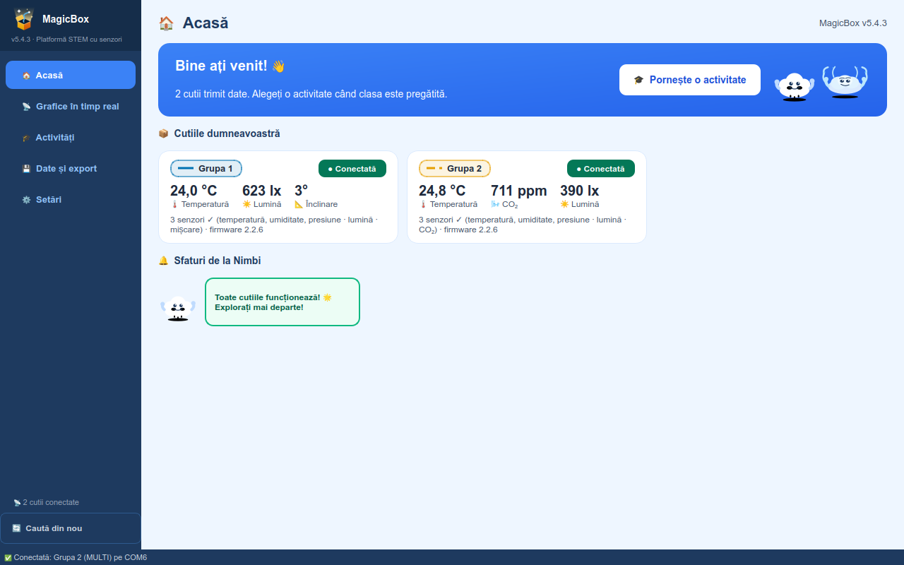
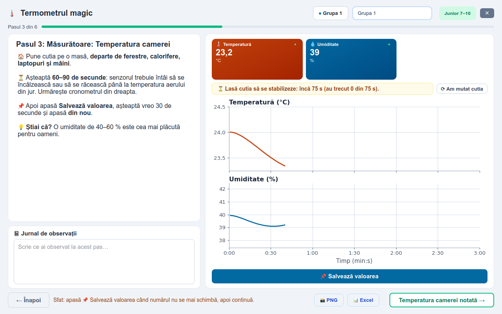

# MagicBox

[English](README.md) · **Română**

**Versiunea 5.6.1** · Windows 10 / 11 · aplicația în engleză, română, franceză și germană; documentele în română și în engleză

## Pentru profesori

MagicBox este o cutie cu senzori pentru ora de științe. Elevii măsoară cu ea
temperatura, umiditatea, presiunea aerului, lumina, dioxidul de carbon și
mișcarea. Aplicația de pe calculator arată măsurătorile pe grafice, în timp
real, și conduce clasa prin experimente ghidate, instrumente de explorare și
jocuri, de la clasa a II-a până la a XII-a.

**Fiecare activitate are un ghid pentru profesor și o fișă pentru elev, în
română și în engleză.** Ghidul spune cum pregătiți ora, cum o desfășurați,
ce întrebări puneți și unde greșesc de obicei elevii. În aplicație, butonul
**Deschide ghidul** de pe fiecare activitate deschide ghidul potrivit.

*Stânga: pagina Acasă, cu cutiile conectate. Dreapta: un experiment ghidat.
Fiecare ecran și fiecare buton sunt explicate, cu imagini, în
[Manualul de utilizare](MagicBox/docs/ro/manual_de_utilizare.pdf) [⬇](https://github.com/GeoEduLab/MagicBox/raw/main/MagicBox/docs/ro/manual_de_utilizare.pdf).*

### ⬇️ [Descărcați MagicBox 5.6.1 (un singur fișier ZIP)](https://github.com/GeoEduLab/MagicBox/releases/download/v5.6.1/MagicBox_v5.6.1.zip)

Arhiva conține tot: aplicația, ghidurile, fișele, firmware-ul cutiei și
ghidul de instalare a firmware-ului, toate din aceeași versiune.

Doar documentele (ghiduri, fișe, Primii pași, manualul tehnic, ghidul de
firmware, în română și engleză, în aceleași foldere ca în aplicație):
**[MagicBox_docs_v5.6.1.zip](https://github.com/GeoEduLab/MagicBox/releases/download/v5.6.1/MagicBox_docs_v5.6.1.zip)**. Fiecare PDF de mai jos se
deschide și aici, pe GitHub; săgeata ⬇ de lângă el îl descarcă.

---

## 1. Instalarea aplicației

1. Dezarhivați ZIP-ul (clic dreapta → **Extract All…**) în **Documente** sau
   pe un stick. Nu în *Program Files* și nu porniți aplicația direct din ZIP.
   Țineți tot folderul `MagicBox` împreună.
2. Porniți **`MagicBox.exe`**. Nu trebuie instalat nimic altceva.
3. Dacă apare *„Windows a protejat computerul”*, apăsați **Mai multe
   informații → Executare oricum**. Mesajul apare pentru că aplicația nu are
   semnătură comercială, nu pentru că ar fi periculoasă.
4. Când Windows întreabă despre rețea, bifați **Rețele private** și apăsați
   **Permiteți accesul**. Altfel cutiile nu se pot conecta prin WiFi.

Aplicația pornește în engleză. Pentru română: **Settings → Language and
display → Language: Română**, apoi reporniți-o. Aplicația mai are franceza și
germana; manualele sunt în română și engleză.

Pașii de la instalare la prima cutie pe ecran, cu un tabel „ce vedeți → ce
faceți”, sunt în [Primii pași](MagicBox/docs/ro/primii_pasi.pdf) [⬇](https://github.com/GeoEduLab/MagicBox/raw/main/MagicBox/docs/ro/primii_pasi.pdf) (două pagini).

**Prin USB:** folosiți un cablu USB de tip C, *de date*. Dacă cutia nu apare în 10 secunde,
instalați o dată driverul plăcii:
[CP210x](https://www.silabs.com/developers/usb-to-uart-bridge-vcp-drivers)
sau [CH340](https://www.wch-ic.com/downloads/CH341SER_EXE.html).

**Prin WiFi:** o singură dată pentru fiecare cutie, de pe un telefon.

1. Porniți cutia. Prima dată ea face o rețea **MagicBox-XXXX** (XXXX = ultimele
   patru caractere ale ID-ului cutiei; **CutiaMagica-XXXX** la firmware mai
   vechi de 2.2.6). În setările WiFi ale telefonului, atingeți rețeaua ei.
2. Telefonul spune că rețeaua nu are internet (pe Samsung: *Internet may not be
   available*): alegeți **Connect only this time** (Conectare doar de data
   aceasta).
3. Telefonul rămâne conectat la **MagicBox-XXXX**, „fără internet”: e normal.
4. Pagina de configurare se deschide singură; dacă nu, deschideți în browser
   **http://192.168.4.1** (d). Alegeți rețeaua clasei din listă (a), scrieți
   parola (b) și apăsați **Save and connect** (c). Cutia repornește și intră în
   rețea; aplicația o găsește singură.

Cutia vede doar rețele de **2,4 GHz**: la un router cu două benzi, lăsați banda
de 2,4 GHz pornită. Calculatorul și cutiile trebuie să fie în aceeași rețea.
Dacă rețeaua școlii nu merge (rețele cu nume de utilizator *și* parolă, sau
care nu lasă aparatele să se vadă între ele), folosiți hotspotul unui telefon.
Pentru o altă rețea: țineți apăsat butonul BOOT al cutiei cât o porniți, iar
cutia uită rețeaua salvată.

**Senzorii:** cutia are trei socluri pentru patru senzori, deci unul lipsește
mereu, iar la pornire apare ca `FAIL`: e normal. Cu cutia oprită, puneți
senzorul de care are nevoie activitatea (jocurile cer senzorul de mișcare).

## 2. Firmware-ul cutiei

Cutiile care funcționează nu trebuie reprogramate. Firmware-ul se încarcă la
o cutie nouă sau când aplicația vă avertizează că o cutie are firmware vechi.
Pașii, cu imagini, sunt în
[ghidul de instalare a firmware-ului](MagicBox/firmware/FLASHING_GUIDE_RO.pdf) [⬇](https://github.com/GeoEduLab/MagicBox/raw/main/MagicBox/firmware/FLASHING_GUIDE_RO.pdf):
circa 30 de minute prima dată, apoi 2–3 minute pe cutie. Folosiți varianta
`serial_wifi_…` (USB și WiFi) din folderul [firmware](MagicBox/firmware).

Dacă o cutie așezată pe masă arată accelerația Z cam −1 g în loc de +1 g,
bifați **Senzor de mișcare întors** la acea cutie, în **Setări → Numele
cutiilor**. Nu e nevoie de alt firmware.

## 3. Documentele

Toate documentele într-o singură arhivă:
**[MagicBox_docs_v5.6.1.zip](https://github.com/GeoEduLab/MagicBox/releases/download/v5.6.1/MagicBox_docs_v5.6.1.zip)**. Un PDF anume: clic pe nume ca
să-l citiți pe GitHub, sau pe ⬇ ca să-l descărcați.

| | Română | English |
|---|---|---|
| Primii pași: instalare, conectare, probleme frecvente | [primii_pasi.pdf](MagicBox/docs/ro/primii_pasi.pdf) [⬇](https://github.com/GeoEduLab/MagicBox/raw/main/MagicBox/docs/ro/primii_pasi.pdf) | [first_steps.pdf](MagicBox/docs/en/first_steps.pdf) [⬇](https://github.com/GeoEduLab/MagicBox/raw/main/MagicBox/docs/en/first_steps.pdf) |
| Manualul de utilizare: fiecare ecran și fiecare buton, cu imagini | [manual_de_utilizare.pdf](MagicBox/docs/ro/manual_de_utilizare.pdf) [⬇](https://github.com/GeoEduLab/MagicBox/raw/main/MagicBox/docs/ro/manual_de_utilizare.pdf) | [user_manual.pdf](MagicBox/docs/en/user_manual.pdf) [⬇](https://github.com/GeoEduLab/MagicBox/raw/main/MagicBox/docs/en/user_manual.pdf) |
| Activitățile pe clase și discipline (o pagină) | [activitatile_pe_clase_si_discipline.pdf](MagicBox/docs/ro/activitatile_pe_clase_si_discipline.pdf) [⬇](https://github.com/GeoEduLab/MagicBox/raw/main/MagicBox/docs/ro/activitatile_pe_clase_si_discipline.pdf) | [activities_by_grade_and_subject.pdf](MagicBox/docs/en/activities_by_grade_and_subject.pdf) [⬇](https://github.com/GeoEduLab/MagicBox/raw/main/MagicBox/docs/en/activities_by_grade_and_subject.pdf) |
| Planul curricular (ce activitate la ce clasă) | [plan_curricular.pdf](MagicBox/docs/ro/plan_curricular.pdf) [⬇](https://github.com/GeoEduLab/MagicBox/raw/main/MagicBox/docs/ro/plan_curricular.pdf) | [curriculum_plan.pdf](MagicBox/docs/en/curriculum_plan.pdf) [⬇](https://github.com/GeoEduLab/MagicBox/raw/main/MagicBox/docs/en/curriculum_plan.pdf) |
| Manualul tehnic și problemele frecvente | [manual_tehnic.pdf](MagicBox/docs/ro/manual_tehnic.pdf) [⬇](https://github.com/GeoEduLab/MagicBox/raw/main/MagicBox/docs/ro/manual_tehnic.pdf) | [technical_manual.pdf](MagicBox/docs/en/technical_manual.pdf) [⬇](https://github.com/GeoEduLab/MagicBox/raw/main/MagicBox/docs/en/technical_manual.pdf) |
| Instalarea firmware-ului | [FLASHING_GUIDE_RO.pdf](MagicBox/firmware/FLASHING_GUIDE_RO.pdf) [⬇](https://github.com/GeoEduLab/MagicBox/raw/main/MagicBox/firmware/FLASHING_GUIDE_RO.pdf) | [FLASHING_GUIDE.pdf](MagicBox/firmware/FLASHING_GUIDE.pdf) [⬇](https://github.com/GeoEduLab/MagicBox/raw/main/MagicBox/firmware/FLASHING_GUIDE.pdf) |

Ce s-a schimbat de la o versiune la alta: [CHANGELOG.txt](MagicBox/CHANGELOG.txt)
(aplicația) și [firmware/CHANGELOG.txt](MagicBox/firmware/CHANGELOG.txt).

---

## Activitățile

Toate PDF-urile se deschid direct aici, pe GitHub; ⬇ de lângă fiecare descarcă fișierul.

### Experimente ghidate

| Activitate | Clasele | Ghidul profesorului | Fișa elevului |
|---|---|---|---|
| 🌞 Lumina de pretutindeni | II–IV | [RO](MagicBox/docs/ro/ghiduri_profesor/lumina_de_pretutindeni.pdf) [⬇](https://github.com/GeoEduLab/MagicBox/raw/main/MagicBox/docs/ro/ghiduri_profesor/lumina_de_pretutindeni.pdf) · [EN](MagicBox/docs/en/teacher_guides/light_is_everywhere.pdf) [⬇](https://github.com/GeoEduLab/MagicBox/raw/main/MagicBox/docs/en/teacher_guides/light_is_everywhere.pdf) | [RO](MagicBox/docs/ro/fise_elev/lumina_de_pretutindeni.pdf) [⬇](https://github.com/GeoEduLab/MagicBox/raw/main/MagicBox/docs/ro/fise_elev/lumina_de_pretutindeni.pdf) · [EN](MagicBox/docs/en/student_sheets/light_is_everywhere.pdf) [⬇](https://github.com/GeoEduLab/MagicBox/raw/main/MagicBox/docs/en/student_sheets/light_is_everywhere.pdf) |
| 🌡️ Termometrul magic | II–IV | [RO](MagicBox/docs/ro/ghiduri_profesor/termometrul_magic.pdf) [⬇](https://github.com/GeoEduLab/MagicBox/raw/main/MagicBox/docs/ro/ghiduri_profesor/termometrul_magic.pdf) · [EN](MagicBox/docs/en/teacher_guides/magic_thermometer.pdf) [⬇](https://github.com/GeoEduLab/MagicBox/raw/main/MagicBox/docs/en/teacher_guides/magic_thermometer.pdf) | [RO](MagicBox/docs/ro/fise_elev/termometrul_magic.pdf) [⬇](https://github.com/GeoEduLab/MagicBox/raw/main/MagicBox/docs/ro/fise_elev/termometrul_magic.pdf) · [EN](MagicBox/docs/en/student_sheets/magic_thermometer.pdf) [⬇](https://github.com/GeoEduLab/MagicBox/raw/main/MagicBox/docs/en/student_sheets/magic_thermometer.pdf) |
| 🫁 Aerul pe care îl respirăm | II–IV | [RO](MagicBox/docs/ro/ghiduri_profesor/aerul_pe_care_il_respiram.pdf) [⬇](https://github.com/GeoEduLab/MagicBox/raw/main/MagicBox/docs/ro/ghiduri_profesor/aerul_pe_care_il_respiram.pdf) · [EN](MagicBox/docs/en/teacher_guides/air_we_breathe.pdf) [⬇](https://github.com/GeoEduLab/MagicBox/raw/main/MagicBox/docs/en/teacher_guides/air_we_breathe.pdf) | [RO](MagicBox/docs/ro/fise_elev/aerul_pe_care_il_respiram.pdf) [⬇](https://github.com/GeoEduLab/MagicBox/raw/main/MagicBox/docs/ro/fise_elev/aerul_pe_care_il_respiram.pdf) · [EN](MagicBox/docs/en/student_sheets/air_we_breathe.pdf) [⬇](https://github.com/GeoEduLab/MagicBox/raw/main/MagicBox/docs/en/student_sheets/air_we_breathe.pdf) |
| 🏠 Poluarea de interior | V–VIII | [RO](MagicBox/docs/ro/ghiduri_profesor/poluarea_de_interior.pdf) [⬇](https://github.com/GeoEduLab/MagicBox/raw/main/MagicBox/docs/ro/ghiduri_profesor/poluarea_de_interior.pdf) · [EN](MagicBox/docs/en/teacher_guides/indoor_pollution.pdf) [⬇](https://github.com/GeoEduLab/MagicBox/raw/main/MagicBox/docs/en/teacher_guides/indoor_pollution.pdf) | [RO](MagicBox/docs/ro/fise_elev/poluarea_de_interior.pdf) [⬇](https://github.com/GeoEduLab/MagicBox/raw/main/MagicBox/docs/ro/fise_elev/poluarea_de_interior.pdf) · [EN](MagicBox/docs/en/student_sheets/indoor_pollution.pdf) [⬇](https://github.com/GeoEduLab/MagicBox/raw/main/MagicBox/docs/en/student_sheets/indoor_pollution.pdf) |
| 🌿 CO₂ și fotosinteza | X–XII | [RO](MagicBox/docs/ro/ghiduri_profesor/co2_si_fotosinteza.pdf) [⬇](https://github.com/GeoEduLab/MagicBox/raw/main/MagicBox/docs/ro/ghiduri_profesor/co2_si_fotosinteza.pdf) · [EN](MagicBox/docs/en/teacher_guides/co2_and_photosynthesis.pdf) [⬇](https://github.com/GeoEduLab/MagicBox/raw/main/MagicBox/docs/en/teacher_guides/co2_and_photosynthesis.pdf) | [RO](MagicBox/docs/ro/fise_elev/co2_si_fotosinteza.pdf) [⬇](https://github.com/GeoEduLab/MagicBox/raw/main/MagicBox/docs/ro/fise_elev/co2_si_fotosinteza.pdf) · [EN](MagicBox/docs/en/student_sheets/co2_and_photosynthesis.pdf) [⬇](https://github.com/GeoEduLab/MagicBox/raw/main/MagicBox/docs/en/student_sheets/co2_and_photosynthesis.pdf) |
| 📊 Seismograful | V–XII | [RO](MagicBox/docs/ro/ghiduri_profesor/seismograful.pdf) [⬇](https://github.com/GeoEduLab/MagicBox/raw/main/MagicBox/docs/ro/ghiduri_profesor/seismograful.pdf) · [EN](MagicBox/docs/en/teacher_guides/seismometer.pdf) [⬇](https://github.com/GeoEduLab/MagicBox/raw/main/MagicBox/docs/en/teacher_guides/seismometer.pdf) | [RO](MagicBox/docs/ro/fise_elev/seismograful.pdf) [⬇](https://github.com/GeoEduLab/MagicBox/raw/main/MagicBox/docs/ro/fise_elev/seismograful.pdf) · [EN](MagicBox/docs/en/student_sheets/seismometer.pdf) [⬇](https://github.com/GeoEduLab/MagicBox/raw/main/MagicBox/docs/en/student_sheets/seismometer.pdf) |
| ✈️ Zbor drept | II–IV | [RO](MagicBox/docs/ro/ghiduri_profesor/zbor_drept.pdf) [⬇](https://github.com/GeoEduLab/MagicBox/raw/main/MagicBox/docs/ro/ghiduri_profesor/zbor_drept.pdf) · [EN](MagicBox/docs/en/teacher_guides/flying_straight.pdf) [⬇](https://github.com/GeoEduLab/MagicBox/raw/main/MagicBox/docs/en/teacher_guides/flying_straight.pdf) | [RO](MagicBox/docs/ro/fise_elev/zbor_drept.pdf) [⬇](https://github.com/GeoEduLab/MagicBox/raw/main/MagicBox/docs/ro/fise_elev/zbor_drept.pdf) · [EN](MagicBox/docs/en/student_sheets/flying_straight.pdf) [⬇](https://github.com/GeoEduLab/MagicBox/raw/main/MagicBox/docs/en/student_sheets/flying_straight.pdf) |
| ⚖️ Cutia în echilibru | II–IV | [RO](MagicBox/docs/ro/ghiduri_profesor/cutia_in_echilibru.pdf) [⬇](https://github.com/GeoEduLab/MagicBox/raw/main/MagicBox/docs/ro/ghiduri_profesor/cutia_in_echilibru.pdf) · [EN](MagicBox/docs/en/teacher_guides/box_in_balance.pdf) [⬇](https://github.com/GeoEduLab/MagicBox/raw/main/MagicBox/docs/en/teacher_guides/box_in_balance.pdf) | [RO](MagicBox/docs/ro/fise_elev/cutia_in_echilibru.pdf) [⬇](https://github.com/GeoEduLab/MagicBox/raw/main/MagicBox/docs/ro/fise_elev/cutia_in_echilibru.pdf) · [EN](MagicBox/docs/en/student_sheets/box_in_balance.pdf) [⬇](https://github.com/GeoEduLab/MagicBox/raw/main/MagicBox/docs/en/student_sheets/box_in_balance.pdf) |
| ⛰️ Presiune și altitudine | V–VIII | [RO](MagicBox/docs/ro/ghiduri_profesor/presiune_si_altitudine.pdf) [⬇](https://github.com/GeoEduLab/MagicBox/raw/main/MagicBox/docs/ro/ghiduri_profesor/presiune_si_altitudine.pdf) · [EN](MagicBox/docs/en/teacher_guides/pressure_and_altitude.pdf) [⬇](https://github.com/GeoEduLab/MagicBox/raw/main/MagicBox/docs/en/teacher_guides/pressure_and_altitude.pdf) | [RO](MagicBox/docs/ro/fise_elev/presiune_si_altitudine.pdf) [⬇](https://github.com/GeoEduLab/MagicBox/raw/main/MagicBox/docs/ro/fise_elev/presiune_si_altitudine.pdf) · [EN](MagicBox/docs/en/student_sheets/pressure_and_altitude.pdf) [⬇](https://github.com/GeoEduLab/MagicBox/raw/main/MagicBox/docs/en/student_sheets/pressure_and_altitude.pdf) |
| 🌆 Insule termice | V–VIII | [RO](MagicBox/docs/ro/ghiduri_profesor/insule_termice.pdf) [⬇](https://github.com/GeoEduLab/MagicBox/raw/main/MagicBox/docs/ro/ghiduri_profesor/insule_termice.pdf) · [EN](MagicBox/docs/en/teacher_guides/urban_heat_islands.pdf) [⬇](https://github.com/GeoEduLab/MagicBox/raw/main/MagicBox/docs/en/teacher_guides/urban_heat_islands.pdf) | [RO](MagicBox/docs/ro/fise_elev/insule_termice.pdf) [⬇](https://github.com/GeoEduLab/MagicBox/raw/main/MagicBox/docs/ro/fise_elev/insule_termice.pdf) · [EN](MagicBox/docs/en/student_sheets/urban_heat_islands.pdf) [⬇](https://github.com/GeoEduLab/MagicBox/raw/main/MagicBox/docs/en/student_sheets/urban_heat_islands.pdf) |
| ⚡ Panouri solare | IX–XII | [RO](MagicBox/docs/ro/ghiduri_profesor/panouri_solare.pdf) [⬇](https://github.com/GeoEduLab/MagicBox/raw/main/MagicBox/docs/ro/ghiduri_profesor/panouri_solare.pdf) · [EN](MagicBox/docs/en/teacher_guides/solar_panels.pdf) [⬇](https://github.com/GeoEduLab/MagicBox/raw/main/MagicBox/docs/en/teacher_guides/solar_panels.pdf) | [RO](MagicBox/docs/ro/fise_elev/panouri_solare.pdf) [⬇](https://github.com/GeoEduLab/MagicBox/raw/main/MagicBox/docs/ro/fise_elev/panouri_solare.pdf) · [EN](MagicBox/docs/en/student_sheets/solar_panels.pdf) [⬇](https://github.com/GeoEduLab/MagicBox/raw/main/MagicBox/docs/en/student_sheets/solar_panels.pdf) |
| 🔥 Convecția aerului | V–VIII | [RO](MagicBox/docs/ro/ghiduri_profesor/convectia_aerului.pdf) [⬇](https://github.com/GeoEduLab/MagicBox/raw/main/MagicBox/docs/ro/ghiduri_profesor/convectia_aerului.pdf) · [EN](MagicBox/docs/en/teacher_guides/air_convection.pdf) [⬇](https://github.com/GeoEduLab/MagicBox/raw/main/MagicBox/docs/en/teacher_guides/air_convection.pdf) | [RO](MagicBox/docs/ro/fise_elev/convectia_aerului.pdf) [⬇](https://github.com/GeoEduLab/MagicBox/raw/main/MagicBox/docs/ro/fise_elev/convectia_aerului.pdf) · [EN](MagicBox/docs/en/student_sheets/air_convection.pdf) [⬇](https://github.com/GeoEduLab/MagicBox/raw/main/MagicBox/docs/en/student_sheets/air_convection.pdf) |
| 💧 Ciclul apei | V–VIII | [RO](MagicBox/docs/ro/ghiduri_profesor/ciclul_apei.pdf) [⬇](https://github.com/GeoEduLab/MagicBox/raw/main/MagicBox/docs/ro/ghiduri_profesor/ciclul_apei.pdf) · [EN](MagicBox/docs/en/teacher_guides/water_cycle.pdf) [⬇](https://github.com/GeoEduLab/MagicBox/raw/main/MagicBox/docs/en/teacher_guides/water_cycle.pdf) | [RO](MagicBox/docs/ro/fise_elev/ciclul_apei.pdf) [⬇](https://github.com/GeoEduLab/MagicBox/raw/main/MagicBox/docs/ro/fise_elev/ciclul_apei.pdf) · [EN](MagicBox/docs/en/student_sheets/water_cycle.pdf) [⬇](https://github.com/GeoEduLab/MagicBox/raw/main/MagicBox/docs/en/student_sheets/water_cycle.pdf) |
| 🌐 Fizica atmosferei | IX–XII | [RO](MagicBox/docs/ro/ghiduri_profesor/fizica_atmosferei.pdf) [⬇](https://github.com/GeoEduLab/MagicBox/raw/main/MagicBox/docs/ro/ghiduri_profesor/fizica_atmosferei.pdf) · [EN](MagicBox/docs/en/teacher_guides/physics_of_the_atmosphere.pdf) [⬇](https://github.com/GeoEduLab/MagicBox/raw/main/MagicBox/docs/en/teacher_guides/physics_of_the_atmosphere.pdf) | [RO](MagicBox/docs/ro/fise_elev/fizica_atmosferei.pdf) [⬇](https://github.com/GeoEduLab/MagicBox/raw/main/MagicBox/docs/ro/fise_elev/fizica_atmosferei.pdf) · [EN](MagicBox/docs/en/student_sheets/physics_of_the_atmosphere.pdf) [⬇](https://github.com/GeoEduLab/MagicBox/raw/main/MagicBox/docs/en/student_sheets/physics_of_the_atmosphere.pdf) |
| ⚗️ Legea Beer–Lambert | X–XII | [RO](MagicBox/docs/ro/ghiduri_profesor/legea_beer_lambert.pdf) [⬇](https://github.com/GeoEduLab/MagicBox/raw/main/MagicBox/docs/ro/ghiduri_profesor/legea_beer_lambert.pdf) · [EN](MagicBox/docs/en/teacher_guides/beer_lambert_law.pdf) [⬇](https://github.com/GeoEduLab/MagicBox/raw/main/MagicBox/docs/en/teacher_guides/beer_lambert_law.pdf) | [RO](MagicBox/docs/ro/fise_elev/legea_beer_lambert.pdf) [⬇](https://github.com/GeoEduLab/MagicBox/raw/main/MagicBox/docs/ro/fise_elev/legea_beer_lambert.pdf) · [EN](MagicBox/docs/en/student_sheets/beer_lambert_law.pdf) [⬇](https://github.com/GeoEduLab/MagicBox/raw/main/MagicBox/docs/en/student_sheets/beer_lambert_law.pdf) |

### Instrumente de explorare

| Activitate | Clasele | Ghidul profesorului | Fișa elevului |
|---|---|---|---|
| 📌 Carnetul de măsurători | IV–XII | [RO](MagicBox/docs/ro/ghiduri_profesor/carnetul_de_masuratori.pdf) [⬇](https://github.com/GeoEduLab/MagicBox/raw/main/MagicBox/docs/ro/ghiduri_profesor/carnetul_de_masuratori.pdf) · [EN](MagicBox/docs/en/teacher_guides/measurement_notebook.pdf) [⬇](https://github.com/GeoEduLab/MagicBox/raw/main/MagicBox/docs/en/teacher_guides/measurement_notebook.pdf) | [RO](MagicBox/docs/ro/fise_elev/carnetul_de_masuratori.pdf) [⬇](https://github.com/GeoEduLab/MagicBox/raw/main/MagicBox/docs/ro/fise_elev/carnetul_de_masuratori.pdf) · [EN](MagicBox/docs/en/student_sheets/measurement_notebook.pdf) [⬇](https://github.com/GeoEduLab/MagicBox/raw/main/MagicBox/docs/en/student_sheets/measurement_notebook.pdf) |
| 🌦️ Stația meteo | V–XII | [RO](MagicBox/docs/ro/ghiduri_profesor/statia_meteo.pdf) [⬇](https://github.com/GeoEduLab/MagicBox/raw/main/MagicBox/docs/ro/ghiduri_profesor/statia_meteo.pdf) · [EN](MagicBox/docs/en/teacher_guides/weather_station.pdf) [⬇](https://github.com/GeoEduLab/MagicBox/raw/main/MagicBox/docs/en/teacher_guides/weather_station.pdf) | [RO](MagicBox/docs/ro/fise_elev/statia_meteo.pdf) [⬇](https://github.com/GeoEduLab/MagicBox/raw/main/MagicBox/docs/ro/fise_elev/statia_meteo.pdf) · [EN](MagicBox/docs/en/student_sheets/weather_station.pdf) [⬇](https://github.com/GeoEduLab/MagicBox/raw/main/MagicBox/docs/en/student_sheets/weather_station.pdf) |
| 🌬️ Calitatea aerului | V–XII | [RO](MagicBox/docs/ro/ghiduri_profesor/calitatea_aerului.pdf) [⬇](https://github.com/GeoEduLab/MagicBox/raw/main/MagicBox/docs/ro/ghiduri_profesor/calitatea_aerului.pdf) · [EN](MagicBox/docs/en/teacher_guides/air_quality.pdf) [⬇](https://github.com/GeoEduLab/MagicBox/raw/main/MagicBox/docs/en/teacher_guides/air_quality.pdf) | [RO](MagicBox/docs/ro/fise_elev/calitatea_aerului.pdf) [⬇](https://github.com/GeoEduLab/MagicBox/raw/main/MagicBox/docs/ro/fise_elev/calitatea_aerului.pdf) · [EN](MagicBox/docs/en/student_sheets/air_quality.pdf) [⬇](https://github.com/GeoEduLab/MagicBox/raw/main/MagicBox/docs/en/student_sheets/air_quality.pdf) |
| ☀️ Energia solară | VI–XII | [RO](MagicBox/docs/ro/ghiduri_profesor/energia_solara.pdf) [⬇](https://github.com/GeoEduLab/MagicBox/raw/main/MagicBox/docs/ro/ghiduri_profesor/energia_solara.pdf) · [EN](MagicBox/docs/en/teacher_guides/solar_energy.pdf) [⬇](https://github.com/GeoEduLab/MagicBox/raw/main/MagicBox/docs/en/teacher_guides/solar_energy.pdf) | [RO](MagicBox/docs/ro/fise_elev/energia_solara.pdf) [⬇](https://github.com/GeoEduLab/MagicBox/raw/main/MagicBox/docs/ro/fise_elev/energia_solara.pdf) · [EN](MagicBox/docs/en/student_sheets/solar_energy.pdf) [⬇](https://github.com/GeoEduLab/MagicBox/raw/main/MagicBox/docs/en/student_sheets/solar_energy.pdf) |
| 📐 Seismologie | V–XII | [RO](MagicBox/docs/ro/ghiduri_profesor/seismologie.pdf) [⬇](https://github.com/GeoEduLab/MagicBox/raw/main/MagicBox/docs/ro/ghiduri_profesor/seismologie.pdf) · [EN](MagicBox/docs/en/teacher_guides/seismology.pdf) [⬇](https://github.com/GeoEduLab/MagicBox/raw/main/MagicBox/docs/en/teacher_guides/seismology.pdf) | [RO](MagicBox/docs/ro/fise_elev/seismologie.pdf) [⬇](https://github.com/GeoEduLab/MagicBox/raw/main/MagicBox/docs/ro/fise_elev/seismologie.pdf) · [EN](MagicBox/docs/en/student_sheets/seismology.pdf) [⬇](https://github.com/GeoEduLab/MagicBox/raw/main/MagicBox/docs/en/student_sheets/seismology.pdf) |
| 🌆 Insule termice cu mai multe cutii | V–XII | [RO](MagicBox/docs/ro/ghiduri_profesor/insule_termice_cu_mai_multe_cutii.pdf) [⬇](https://github.com/GeoEduLab/MagicBox/raw/main/MagicBox/docs/ro/ghiduri_profesor/insule_termice_cu_mai_multe_cutii.pdf) · [EN](MagicBox/docs/en/teacher_guides/heat_islands_with_several_boxes.pdf) [⬇](https://github.com/GeoEduLab/MagicBox/raw/main/MagicBox/docs/en/teacher_guides/heat_islands_with_several_boxes.pdf) | [RO](MagicBox/docs/ro/fise_elev/insule_termice_cu_mai_multe_cutii.pdf) [⬇](https://github.com/GeoEduLab/MagicBox/raw/main/MagicBox/docs/ro/fise_elev/insule_termice_cu_mai_multe_cutii.pdf) · [EN](MagicBox/docs/en/student_sheets/heat_islands_with_several_boxes.pdf) [⬇](https://github.com/GeoEduLab/MagicBox/raw/main/MagicBox/docs/en/student_sheets/heat_islands_with_several_boxes.pdf) |
| 🌿 Efectul de seră | V–XII | [RO](MagicBox/docs/ro/ghiduri_profesor/efectul_de_sera.pdf) [⬇](https://github.com/GeoEduLab/MagicBox/raw/main/MagicBox/docs/ro/ghiduri_profesor/efectul_de_sera.pdf) · [EN](MagicBox/docs/en/teacher_guides/greenhouse_effect.pdf) [⬇](https://github.com/GeoEduLab/MagicBox/raw/main/MagicBox/docs/en/teacher_guides/greenhouse_effect.pdf) | [RO](MagicBox/docs/ro/fise_elev/efectul_de_sera.pdf) [⬇](https://github.com/GeoEduLab/MagicBox/raw/main/MagicBox/docs/ro/fise_elev/efectul_de_sera.pdf) · [EN](MagicBox/docs/en/student_sheets/greenhouse_effect.pdf) [⬇](https://github.com/GeoEduLab/MagicBox/raw/main/MagicBox/docs/en/student_sheets/greenhouse_effect.pdf) |
| 🔬 Spectroscopie | IX–XII | [RO](MagicBox/docs/ro/ghiduri_profesor/spectroscopie.pdf) [⬇](https://github.com/GeoEduLab/MagicBox/raw/main/MagicBox/docs/ro/ghiduri_profesor/spectroscopie.pdf) · [EN](MagicBox/docs/en/teacher_guides/spectroscopy.pdf) [⬇](https://github.com/GeoEduLab/MagicBox/raw/main/MagicBox/docs/en/teacher_guides/spectroscopy.pdf) | [RO](MagicBox/docs/ro/fise_elev/spectroscopie.pdf) [⬇](https://github.com/GeoEduLab/MagicBox/raw/main/MagicBox/docs/ro/fise_elev/spectroscopie.pdf) · [EN](MagicBox/docs/en/student_sheets/spectroscopy.pdf) [⬇](https://github.com/GeoEduLab/MagicBox/raw/main/MagicBox/docs/en/student_sheets/spectroscopy.pdf) |

### Jocuri

| Activitate | Clasele | Ghidul profesorului | Fișa elevului |
|---|---|---|---|
| 🎮 Printre nori | II–VIII | [RO](MagicBox/docs/ro/ghiduri_profesor/printre_nori.pdf) [⬇](https://github.com/GeoEduLab/MagicBox/raw/main/MagicBox/docs/ro/ghiduri_profesor/printre_nori.pdf) · [EN](MagicBox/docs/en/teacher_guides/among_the_clouds.pdf) [⬇](https://github.com/GeoEduLab/MagicBox/raw/main/MagicBox/docs/en/teacher_guides/among_the_clouds.pdf) | [RO](MagicBox/docs/ro/fise_elev/printre_nori.pdf) [⬇](https://github.com/GeoEduLab/MagicBox/raw/main/MagicBox/docs/ro/fise_elev/printre_nori.pdf) · [EN](MagicBox/docs/en/student_sheets/among_the_clouds.pdf) [⬇](https://github.com/GeoEduLab/MagicBox/raw/main/MagicBox/docs/en/student_sheets/among_the_clouds.pdf) |
| 🎮 Cutremur! | IV–XII | [RO](MagicBox/docs/ro/ghiduri_profesor/cutremur.pdf) [⬇](https://github.com/GeoEduLab/MagicBox/raw/main/MagicBox/docs/ro/ghiduri_profesor/cutremur.pdf) · [EN](MagicBox/docs/en/teacher_guides/earthquake.pdf) [⬇](https://github.com/GeoEduLab/MagicBox/raw/main/MagicBox/docs/en/teacher_guides/earthquake.pdf) | [RO](MagicBox/docs/ro/fise_elev/cutremur.pdf) [⬇](https://github.com/GeoEduLab/MagicBox/raw/main/MagicBox/docs/ro/fise_elev/cutremur.pdf) · [EN](MagicBox/docs/en/student_sheets/earthquake.pdf) [⬇](https://github.com/GeoEduLab/MagicBox/raw/main/MagicBox/docs/en/student_sheets/earthquake.pdf) |
| 🎮 Rezonanța | XI | [RO](MagicBox/docs/ro/ghiduri_profesor/rezonanta.pdf) [⬇](https://github.com/GeoEduLab/MagicBox/raw/main/MagicBox/docs/ro/ghiduri_profesor/rezonanta.pdf) · [EN](MagicBox/docs/en/teacher_guides/resonance.pdf) [⬇](https://github.com/GeoEduLab/MagicBox/raw/main/MagicBox/docs/en/teacher_guides/resonance.pdf) | [RO](MagicBox/docs/ro/fise_elev/rezonanta.pdf) [⬇](https://github.com/GeoEduLab/MagicBox/raw/main/MagicBox/docs/ro/fise_elev/rezonanta.pdf) · [EN](MagicBox/docs/en/student_sheets/resonance.pdf) [⬇](https://github.com/GeoEduLab/MagicBox/raw/main/MagicBox/docs/en/student_sheets/resonance.pdf) |
| 🎯 Ținta giroscopică | V–XII | [RO](MagicBox/docs/ro/ghiduri_profesor/tinta_giroscopica.pdf) [⬇](https://github.com/GeoEduLab/MagicBox/raw/main/MagicBox/docs/ro/ghiduri_profesor/tinta_giroscopica.pdf) · [EN](MagicBox/docs/en/teacher_guides/gyro_target.pdf) [⬇](https://github.com/GeoEduLab/MagicBox/raw/main/MagicBox/docs/en/teacher_guides/gyro_target.pdf) | [RO](MagicBox/docs/ro/fise_elev/tinta_giroscopica.pdf) [⬇](https://github.com/GeoEduLab/MagicBox/raw/main/MagicBox/docs/ro/fise_elev/tinta_giroscopica.pdf) · [EN](MagicBox/docs/en/student_sheets/gyro_target.pdf) [⬇](https://github.com/GeoEduLab/MagicBox/raw/main/MagicBox/docs/en/student_sheets/gyro_target.pdf) |
